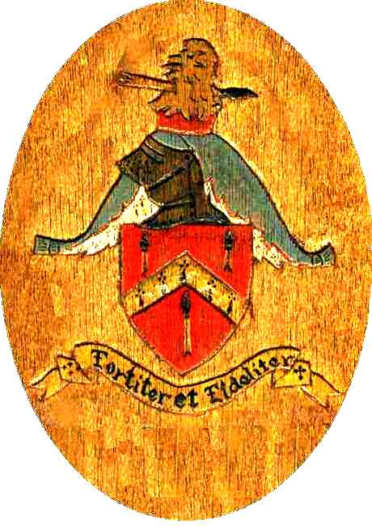

# mjpcarving.art Web Page

The domain mjpcarving.art was purchased for 5 years from [godaddy.com](http://godaddy.com) mid 2025\. Since at this time there are no plans for this to be a commercial site it was a goal to put this together as cheaply as possible, and includes no reference to my name, email or phone number. I found free hosting at “[infinityfree.com](http://infinityfree.com)”. Username is [mark@penniman.net](mailto:mark@penniman.net), password is On2Narnia. URL is: [https://dash.infinityfree.com/accounts/if0\_36794951](https://dash.infinityfree.com/accounts/if0_36794951) . Log in with the username and password. In the center of the resulting web page ‘mjpcarving.art’ is listed. Select ‘Manage’. Every 3 months or so it is necessary to create and install a new free SSL certificate from “Let’s Encrypt”. When a new SSL is created it takes a while to process. Click on ‘File Manager’. The various files used are:   
htdocs/index.php \= initial web page, links to thumbnails  
\<\!-- index.php →  
\<\!doctype html\>  
\<html\>  
\<head\>  
\<link rel="stylesheet" href="style.css"\>  
\</head\>  
\<title\>Wood Carvings\</title\>  
\<center\>  
\<h1\>Marco's Woodcarvings\</h1\>  
\<image src="Carving Logo.jpg" width="410" height="540"\>\<br\>  
\<?php  
print "While still in high school Mark (Marco) got his first commercial woodcarving job. It was probably a referral through the art store where he worked. At that time he worked in trade for carving tools. The split between his own designs and following a design are about 50/50. Here and there he has done a few commercial jobs but for the most part woodcarving has been a source of recreation for him, as it is now in 2024\. (NOTE: this rudimentary website was created the same way Marco likes to do his carvings. By hand. The old fashioned way. No motorized tools)\<br\> \<br\> Exodus 31:3-5  
\\"I have filled him with the Spirit of God, with ability and intelligence, with knowledge and all craftsmanship, to devise artistic designs, to work in gold, silver, and bronze, in cutting stones for setting, and in \<b\>carving wood\</b\>, to work in every craft.\\" ";  
 	 ?\>  
 \<h1\>  
    \<p\>  
 \<a href="samples2.html"\>Samples\</a\>  
    \</p\>  
    \</h1\>  
\</body\>  
\</html\>

htdocs/samples2.html \= links to thumbnail pictures of carvings  
	Example:  
	\<\!-- sample2.html →  
\<\!doctype html\>  
\<html\>  
    \<head\>  
          \<link rel="stylesheet" href="style.css"\>  
    \</head\>  
\<body\>  
\<title\>Wood Carvings\</title\>  
\<center\>  
\<h1\>Marco's Woodcarvings\</h1\>  
   \<h3\>Woodcarvings over the years\</h3\>  
     \<a href="Carvings/ChurchSign.html"\>  
        \  
     \</a\>  
…  
      \<a href="Carvings/LIONSHEAD.html"\>  
         \  
     \</a\>  
\</body\>  
\</html\>

htdocs/carvings/yyyy-name.jpg (or jpeg) \= image file, picture of the carving  
htdocs/carvings/name.html \= links to image file and has description:   
Example:  
\<\!-- Bellows2.html →  
\<\!doctype html\>  
\<html\>  
    \<head\>  
        \<link rel="stylesheet" href="../style.css"\>  
    \</head\>  
\<body\>  
   \<title\>Wood Carvings\</title\>  
   \<center\>  
       \  
       		      \<br\>  
     	\<figcaption\>  
   	    2000-Bellows2.jpg rendition of the Penniman family crest. Executed in Philippine mahogany.  
	\</figcaption\>  
 	   \</figure\>  
\</body\>  
\</html\>  
htdocs/style css \= style document that effects whole webpage located in the htdocs directory
body {   
    color: brown;  
    background-color: tan;   
   }  
h1 h3 {   
    color:\#381c07ff;   
    }  
p {  
    color: brown;   
  }  
img.ImageBorder {  
    border: 5px solid \#555;  
    padding: 1px;  
    /\* border-style: solid black;  
 	  border-width: 3px; \*/  
}  
